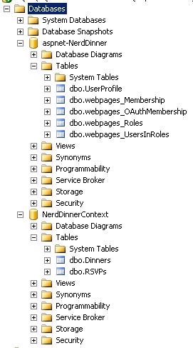
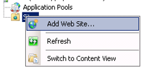
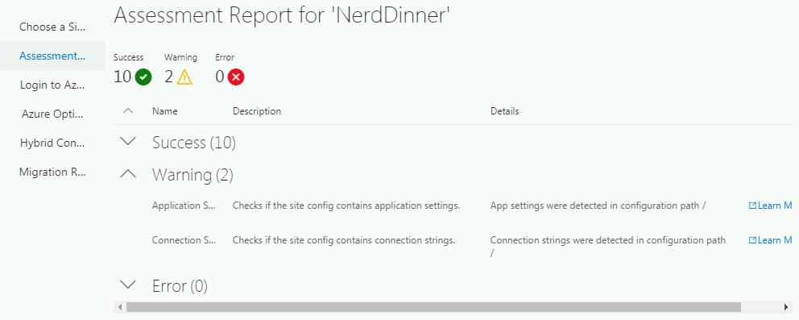

Tutorial – Migrate an already running .Net 4 legacy app backed by SQL on Windows 2008 R2 to Azure App Services
==============================================================================================================

Part 1 - Migrate Legacy App to Azure App Services (without original code)
-------------------------------------------------------------------------

### Pre-Tasks for the Source Database Environment

You will need to setup your environment with SQL 2008 R2. I set this up on a
Windows Server 2008 R2 Server with SQL 2008 R2 Database, both platforms will be
out of support soon. Clone the source code from
[here](https://github.com/frehnejc/NerdDinner), you will use the provided DB
Creation Scripts to create the two databases. To create the databases:

1.  Start SQL Server Management Studio.

2.  Starting with the first Database “aspnet-NerdDinner” start a new SQL Query
    and paste the contents from the aspnet-script.sql file and execute the
    query, this will create the DB and data.

3.  Repeat the same process by replacing the sql script in your query editor
    with the Context-script.sql, this will create the “NerdDinnerContext” DB.

4.  You will have two databases and tables as shown below:

### Pre-Tasks for the Source IIS Web App Environment

Build a 2008 R2 Server with IIS. Clone the source code from
[here](https://github.com/frehnejc/NerdDinner). Ensure you edit the web.config
with the credentials to connect to your DB Server created with steps above. If
you wantBuild and deploy to your IIS Server by following these steps:

1.  Remove your default website in IIS.

2.  Start a local Visual Studio and run a build and ensure that your app works
    locally, ensure that the database connection is successful by clicking the
    link on the landing page “View all Upcoming Dinners”. All 3 Dinners should
    show. If successful go to the next step.

3.  Create a release by Right Clicking on the NerdDinner Application and
    selecting Publish:

4.  Then Select Publish:

5.  Copy the contents of the release folder NerdDinner\\bin\\Release\\Publish to
    a folder on your IIS Server under C:\\NerdDinner.

6.  Add a new Site in IIS:

    

    1.  Select the options as below then click OK:

        

    2.  Modify the app pool and set the .Net Framework version from 2.0 to 4.0:

    

7.  Ensure the App works by browsing to it as <http://localhost>. Ensure you
    validate that the database connection is successful by clicking the link on
    the landing page “View all Upcoming Dinners”. All 3 Dinners should show.

### Build your Hybrid Connection Manager Machine

Build a Windows 2016 or higher machine as your on premises Hybrid Connection
Manager.

### Overview

This will be a two-part migration, first we will migrate the App to Azure App
Services and create a Hybrid Connection back to the existing on-premises
database. This leaves the original app server untouched.

The second part of the migration we will focus on migrating the database used by
the app using Azure Data Migration Assistant (DMA) to Azure SQL.

### Before App Migration

### After App Migration

### Detailed Steps

1.  Download and install the App Service Migration Assessment tool available
    from [here](https://appmigration.microsoft.com/readiness) on the server that
    is running the NerdDinner Sample app.

2.  Run the Azure App Service Migration Assistant shortcut that is placed on
    your desktop. You will be presented with “Choose a Site”:

3.  Select the NerdDinner site and click Next, the site will be assessed for
    compatibility with Azure App Services. There will be two warnings that can
    be ignored as the app will safely migrate across, you can save the report so
    you can fix them later.

4.  Click Next and enter your credentials to the Azure Portal by copying the
    Device Code and opening the Browser, copy the code and enter your
    credentials to Azure.

5.  Once logged into Azure via the Browser you can close it.

6.  Select an existing or new resource group, a new Destination Site Name,
    Region and leave the option selected to Set up hybrid connection to enable
    database connection, below is a sample:

7.  Select Migrate, the migration starts with a progress report:

8.  When the migration is complete, the new Azure resources will be created as
    shown below:

9.  On your Server 2016 machine allocated as the Hybrid Connection Manager
    install the HCM from
    [here](https://www.microsoft.com/en-au/download/details.aspx?id=42962).

10.  Start the Hybrid Connection Manager UI, click the Add a new Hybrid
    Connection Link, and logon to your subscription, and select the newly
    created endpoint and then save:

11.  You should have a status of “Connected”:

12.  Test your newly created app by browsing to the URL as shown in the Azure
    Portal:

13.  To test the database connection, click the link “View All Upcoming Dinners”:

14.  This validates that the Hybrid Connection is working successfully so should
    show all dinners.

15.  You can scale down the App Service plan to save on costs as the default Plan
    is P1V2 so you can scale down to B1.

Part 2 – Use Data Migration Assistant (DMA) to Migrate the On-Prem Database to Azure SQL PaaS
---------------------------------------------------------------------------------------------

### Overview

>   This is Part 2 of the two-part series, Part 1 deals with migrating the
>   Application to Azure App Services and setting up the source environment. If
>   you haven't already setup your environment.

>   The App uses two databases, one for storing the registered users and another
>   to store the dinner events. The DMA uses six steps:

1.  Select the Source.

2.  Select the Target.

3.  Select the Objects.

4.  Script and Deploy the Schema.

5.  Select the Tables.

6.  Migrate Data.

We will then move out the Connection Strings from the web.config to the App
Service.

### Prerequisites

1.  Download and install the Data Migration Assistant from
    [here](https://www.microsoft.com/en-us/download/details.aspx?id=53595).

2.  Obtain credentials to access the SQL server where the database resides, you
    will need this to migrate the databases.

3.  Create a New Azure SQL Server, remembering to add your Client IP address to
    the firewall and Virtual Networks rule. This SQL Server will host the two
    new databases, take note of the credentials to connect to the SQL Server,
    you will need these later.

4.  Create two new blank databases attached the new SQL Server. Create an
    “aspnet-NerdDinner” and “NerdDinnerContext” database. You could even give
    [SQL
    Serverless](https://docs.microsoft.com/en-us/azure/sql-database/sql-database-serverless)
    a try.

### Before DMA

### After DMA

### Detailed Steps

1.  In a real-world example, you would stop your App to ensure that there is no
    activity on the source database. You would undertake the data migration
    reconfigure the Connection Strings and restart the App.

2.  Launch the DMA and create a New Migration Project.

3.  We will migrate each database starting with the “aspnet-NerdDinner”, so name
    the project as such, the results will be similar to below:

4.  Select Create and enter the Server name of your source SQL Server and the
    appropriate Authentication type, in my case I chose SQL Server
    Authentication, the result should be similar to below, if you haven’t setup
    Encryption on the source database untick this option and select connect, the
    results display as shown in the following graphic:

5.  You will be presented with the Source databases, since we are starting with
    the “asp-NerdDinner” database select this and click Next.

6.  Now select the Destination Azure SQL Server, select the Authentication type
    as SQL Server Authentication (if appropriate) and enter the credentials for
    your destination SQL Server, the result should be similar to below (noting
    the Encrypt connection option is selected). Select Next, the results display
    as shown in the following graphic:

7.  Select the Target Database that has been created earlier in the
    prerequisites section as “aspnet-NerdDinner” and click Next.

8.  You will now be presented with the Schema Objects, by default all will be
    selected, click Generate SQL Script, as shown below:

9.  You will be presented with the SQL Script for the Schema, you have an option
    to save this for later. Click Deploy schema to migrate it to Azure SQL, the
    results are shown below:

10.  To Migrate the data, select the Migrate Data button, you will be shown a
    list of tables like below, click the Start Data Migration to migrate the
    data:

10.  After the migration completes you are presented with the status of the
    migration:

12.  To migrate the “NerdDinnerContext“ database repeat steps 7 to 11, the final
    database migration will display the following:

13.  Now we will go and move the connection strings from the local web.config on
    the App Service to the Application Settings Connection Strings. Cut out the
    two connection strings from the App Service using “Advanced Tools” and save
    them in case you need to back out, below is what is being removed, save this
    file.

14.  Copy the Connection Strings from each of the databases in the azure Portal
    into a temporary Notepad for editing, add your username and password you
    saved earlier from when you created the database. Your notepad will have
    values similar to below. Edit the name of the database to the FQDN from the
    Azure Portal:

Server=tcp:{Portal FQDN},1433;Initial Catalog=aspnet-NerdDinner;Persist Security
Info=False;User
ID=**{your_username}**;Password=**{your_password}**;MultipleActiveResultSets=False;Encrypt=True;TrustServerCertificate=False;Connection
Timeout=30;

Server=tcp:{Portal FQDN},1433;Initial Catalog=NerdDinnerContext;Persist Security
Info=False;User
ID=**{your_username}**;Password=**{your_password}**;MultipleActiveResultSets=False;Encrypt=True;TrustServerCertificate=False;Connection
Timeout=30;

15.  In the Portal add the “Default Connection” Connection String to the App
    Service Configurations Application Settings:

16.  Now add the In the Portal add the “NerdDinnerContext” Connection String to
    the App Service Configurations Application Settings:

17.  You will have the two connection strings as shown, click save:

18.  Your App will be now be using the migrated database, to validate browse to
    it using the URL provided in the portal, and click “View all Upcoming
    Dinners”. If your database migration is successful you will have your
    upcoming dinners displayed.

References
==========

<https://appmigration.microsoft.com/readinesschecks>

<https://docs.microsoft.com/en-us/azure/app-service/app-service-hybrid-connections>

<https://azure.microsoft.com/en-au/blog/introducing-the-app-service-migration-assistant-for-asp-net-applications/>

<https://docs.microsoft.com/en-us/sql/dma/dma-overview>

### Disclaimer:
All views expressed on this post are that of my own and do not represent the opinions of any entity whatsoever with which I have been, am now, or will be affiliated.
